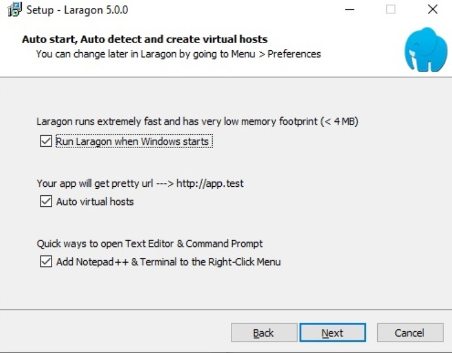
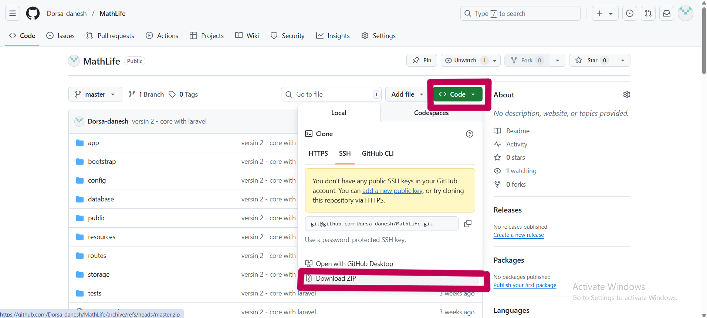
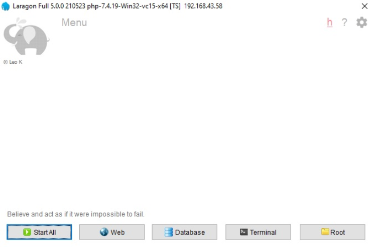
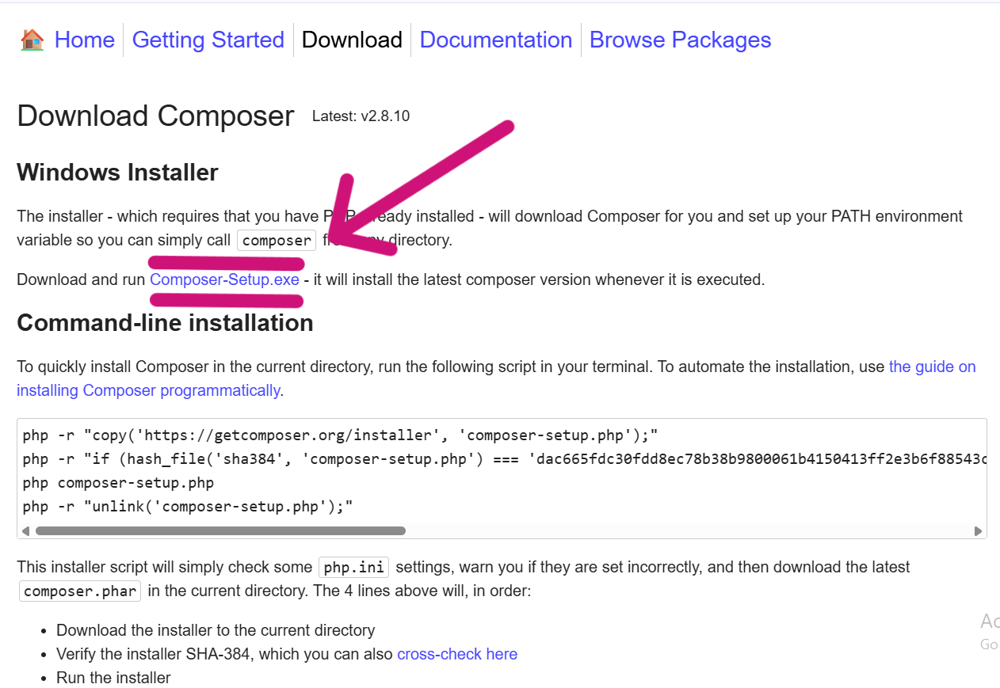

# 🚀 MathLife
این پروژه یک سیستم مدیریت آموزشی ریاضی است که با استفاده از فریم‌ورک لاراول توسعه داده شده است. هدف این پروژه فراهم کردن یک بستر ساده و کاربردی برای آموزش مفاهیم پایه ریاضی نهم است.


## ⚙️ پیش‌نیازها
برای اجرای این پروژه، لازم است نرم‌افزارهای زیر روی سیستم شما نصب شده باشند:

- **Laragon:** (توصیه شده) یک محیط توسعه محلی شامل Apache, MySQL, PHP
- **Composer:** ابزار مدیریت پکیج‌های PHP
- **Node.js و npm:** برای مدیریت وابستگی‌های Front-end


## 🛠️ نصب و راه‌اندازی

برای راه‌اندازی پروژه، مراحل زیر را به ترتیب دنبال کنید.

### **1. دانلود و نصب لاراگون**
برای دانلود لاراگون کافیست روی لینک مقابل کلیک کنید و به [صفحه دانلود لاراگون] (https://laragon.org/download) بروید. سپس روی لینک دانلود کلیک کنید تا دانلود شروع شود.

بعد از دانلود laragon، فایلی که فرمت .exe دارد را اجرا کنید. با این کار پنجره ای باز می‌شود که در آن بعد از انتخاب زبان مدنظر خود (در حالت عادی انگلیسی) “OK” را بزنید.

در این مرحله محل نصب لاراگون را در یک درایو سریع سیستم خود انتخاب کنید ترجیحاً محل نصب را تغییر ندهید. بعد از انتخاب محل ذخیره، گزینه “Next” را انتخاب کنید.
در این پنجره اگر مایلید لاراگون با اجرا شدن ویندوز به طور خودکار اجرا شود، گزینه اول را در حالت تیک خورده نگه دارید. گزینه دوم را نیز بهتر است در حالتی که تیک دارد، باقی بگذارید. 

در مورد گزینه آخر نیز چنانچه ویرایشگر متن پیشرفته‌ای را روی سیستم خود نصب نکرده اید، این گزینه را تیک زده شده باقی بگذارید. با این کار گزینه “++Notepad” به عنوان یک ادیتور متن حرفه‌ای به منوی لاراگون اضافه خواهد شد.





بعد از انتخاب این تنظیمات، روی “Next” کلیک کنید.
در پنجره بعد نیز روی “Install” کلیک کنید تا فرآیند نصب آغاز شود.

بعد از اتمام نصب، پنجره ای را می بینید که باید “Finish” را بزنید. با این کار اگر گزینه اول را انتخاب کرده باشید، سیستم تان Restart خواهد شد.  حالا می توانید آیکون لاراگون روی دسکتاپ خود مشاهده کنید.

### **2. قرار دادن فایل‌های پروژه**
ابتدا فایل های پروژه را از لینک گیت هاب مطابق تصویر زیر دانلود کنید.





سپس فایل‌های پروژه را از حالت فشرده خارج کرده و در پوشه `www` نرم‌افزار **Laragon** قرار دهید. این پوشه معمولاً در مسیر نصب Laragon قرار دارد (معمولا `C:\laragon\www`).


### **3. اجرای Laragon**

نرم‌افزار Laragon را اجرا کرده و روی دکمه **"Start All"** کلیک کنید تا سرویس‌های Apache و MySQL فعال شوند.





### **4. تنظیمات env**

فایل `.env.example` را به `.env` تغییر نام دهید. 

### **5. نصب وابستگی‌های پروژه**

1.  **نصب پکیج‌های PHP:**
    از این لینک به صفحه زیر رفته و [composer](https://getcomposer.org/download/) را نصب کنید.


    


2.  **ایجاد کلید رمزنگاری برای لاراول:**
    برای نصب Node.js می‌توانید از وب‌سایت رسمی آن استفاده کنید.
 به وب‌سایت [Node.js](https://nodejs.org/en/download) بروید.
نسخه مناسب سیستم خود را انتخاب کنید. npm را تغییر ندهید

 فایل دانلود شده را اجرا کنید. در طول فرآیند نصب، گزینه "Automatically install the necessary tools" را انتخاب کنید تا ابزارهای مورد نیاز مانند Python و Visual Studio Build Tools نیز نصب شوند.
 از نصب صحیح همه ی موارد مطمئن شوید.

### **6. اجرای پروژه**
یک ترمینال در پوشه پروژه باز کنید و دستورات زیر را به ترتیب در آن اجرا کنید:

1.  **ایجاد کلید رمزنگاری برای لاراول:**
    ```bash
    php artisan key:generate
    ```


2.  **اجرای Migration و Seed:**
    ```bash
    php artisan migrate --seed
    ```


    این دستور ساختار جداول پایگاه داده را ایجاد کرده و اطلاعات اولیه را در آن‌ها قرار می‌دهد.
3.  **نصب وابستگی‌های Front-end:**
    ```bash
    npm install
    ```


4.  **کامپایل کردن فایل‌های Front-end :**
    ```bash
    npm run dev
    ```


5.  **اجرای پروژه :**
    ```bash
    php artisan serve
    ```


    سپس از طریق آدرس داده شده به پروژه دسترسی دارید.


## 🤝 مشارکت
اگر قصد دارید به این پروژه کمک کنید، لطفاً با من در ارتباط باشید.
dorsadanesh1400@gmail.com


## 📝 مجوز
این پروژه تحت مجوز MIT منتشر شده است.
